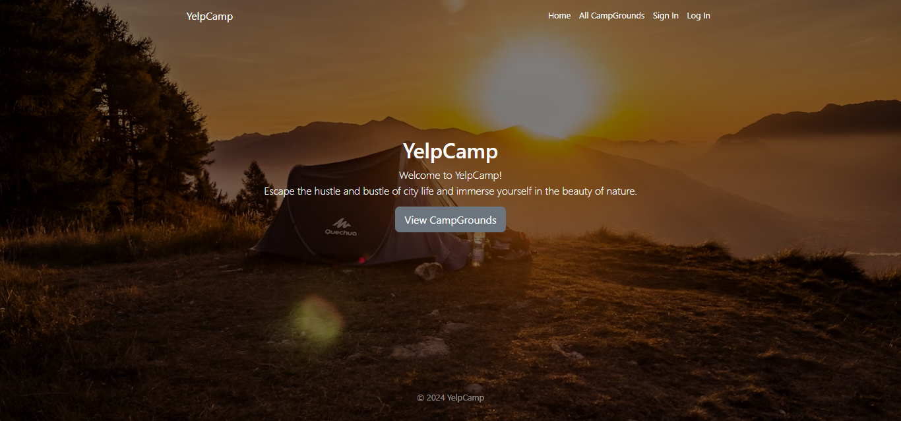
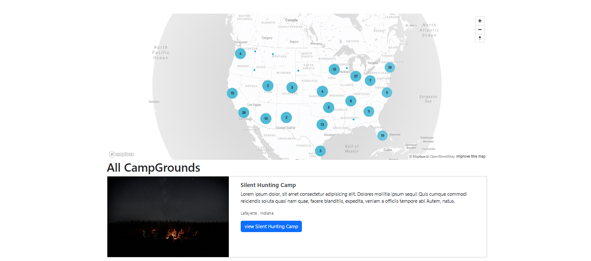
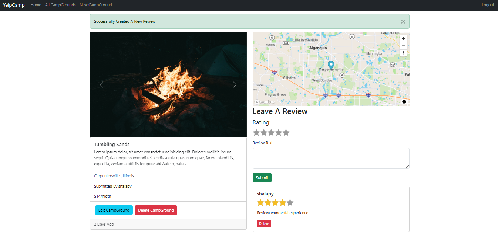
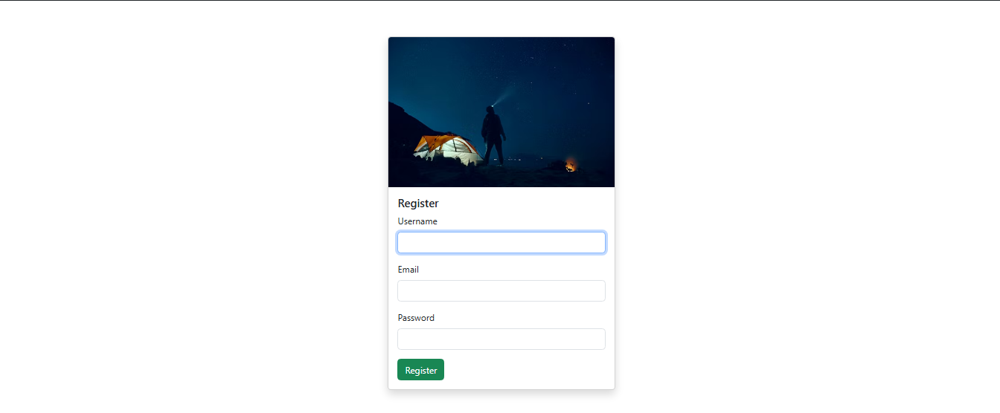

[](https://developer.mozilla.org/en-US/docs/Web/JavaScript)
[](https://developer.mozilla.org/en-US/docs/Web/HTML)
[](https://developer.mozilla.org/en-US/docs/Web/CSS)
[](https://getbootstrap.com/)
[](https://expressjs.com/)
[](https://nodejs.org/docs/latest/api/)
[](https://mongoosejs.com/docs/)
[](https://nodemon.io/)
[](https://ejs.co/)
[](https://www.passportjs.org/)
[](https://www.mapbox.com/)
[](https://www.mongodb.com/docs/)

<!-- PROJECT LOGO -->
<br />
<div align="center">
  <!-- <a href="https://formease-95d4c.web.app/">
    
  </a> -->
  <h1 align="center">YelpCamp</h1>
<!-- 
  <p align="center">
    <a href="https://formease-95d4c.web.app/">View Demo</a>
    ·
    <a href="https://github.com/SalahShallapy/FormEase-V.2-/issues">Report Bug</a>
  </p> -->
</div>

YelpCamp is a full-stack website project where users can create and review campgrounds.
In order to review or create a campground, you must have an account. This project is a part of Colt Steele's web dev bootcamp course on udemy.

## Project Overview

### HomePage



### All Campgrounds



### Single Campground ShowPage



### Login & Register page



## Features

- Users can create, edit, and remove campgrounds
- Users can review campgrounds once, and edit or remove their review
- User profiles include more information on the user (full name, email, phone, join date), their campgrounds, and the option to edit their profile or delete their account
- Search campground by name or location
- Sort campgrounds by highest rating, most reviewed, lowest price, or highest price

## installation

1. Install [mongodb](https://www.mongodb.com/)
2. Create a cloudinary account to get an API key and secret code

```
git clone https://github.com/SalahShallapy/Yelp-Camp
cd yelpcamp
npm install
```

Create a .env file (or just export manually in the terminal) in the root of the project and add the following:

```
DATABASEURL='<url>'
API_KEY=''<key>
API_SECRET='<secret>'
```

Run `mongod` in another terminal and `node app.js` in the terminal with the project.

Then go to [localhost:3000](http://localhost:3000/).

To get google maps working check [this](https://github.com/nax3t/google-maps-api) out.

## Contributing

Contributions are what make the open source community such an amazing place to learn, inspire, and create. Any contributions you make are **greatly appreciated**.

If you have a suggestion that would make this better, please fork the repo and create a pull request. You can also simply open an issue with the tag "enhancement".
Don't forget to give the project a star! Thanks!

1.  Fork the Project
2.  Create your Feature Branch (`git checkout -b feature/AmazingFeature`)
3.  Commit your Changes (`git commit -m 'Add some AmazingFeature'`)
4.  Push to the Branch (`git push origin feature/AmazingFeature`)
5.  Open a Pull Request

   <p align="right">(<a href="#top">back to top</a>)</p>
